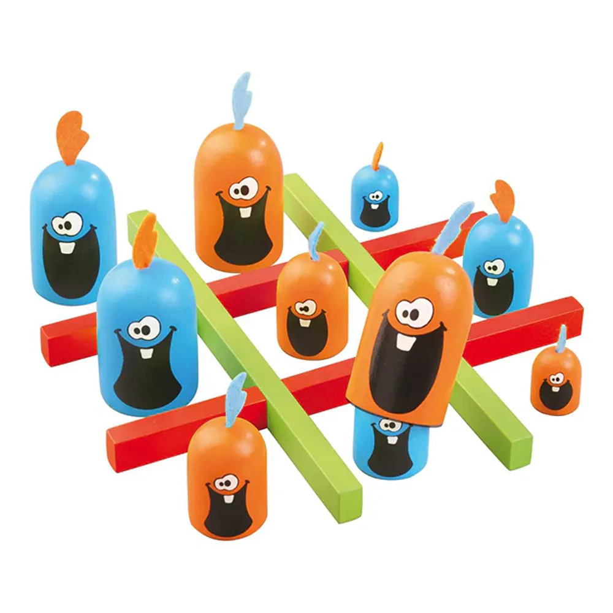
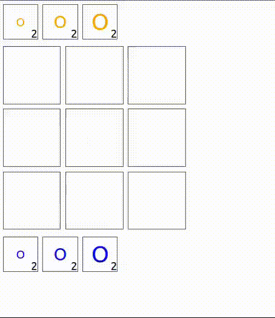

Jogo de tabuleiro implementados utilizando JS, com React para o front-end e com a biblioteca boardgames.io no back-end. Usando a biblioteca boardgames.io, também foi implementada um jogador automático, no qual a partir de uma listagem de jogadas possíveis, a biblioteca utiliza de métodos como Random e MCTS para as jogadas que fará entre os movimentos disponíveis.

## Nhac Nhac (ou Gobblets Gobblers)

Nhac Nhac é um jogo de tabuleiro inspirado no jogo da velha clássico, onde invés de marcações "X" e "O", são usados peças de personagens que podem se cobrir umas às outras (como na imagem). Nessa versão, além de posicionar peças do estoque, peças do tabuleiro que estiverem por cima podem ser reposicionadas pelo jogador.

|   |   |
| - | - |
|  |  |

# Instruções

* Os dois jogadores são controlados por você através do mouse, alternando a vez.
* Começando pelo laranja, clique na peça do estoque que deseja colocar no tabuleiro, e em seguida clique na célula do tabuleiro onde deseja posicioná-la.
* Para mover uma peça, na sua vez clique em uma peça sua que esteja por cima, e em seguida clique na célula pra onde deseja movê-la.
* Peças só podem ser posicionadas em células vazias, ou sobre peças menores que ela. 
* Ganha quem, considerando apenas as peças no topo, fechar uma fileira (assim como no jogo da velha clássico). 
