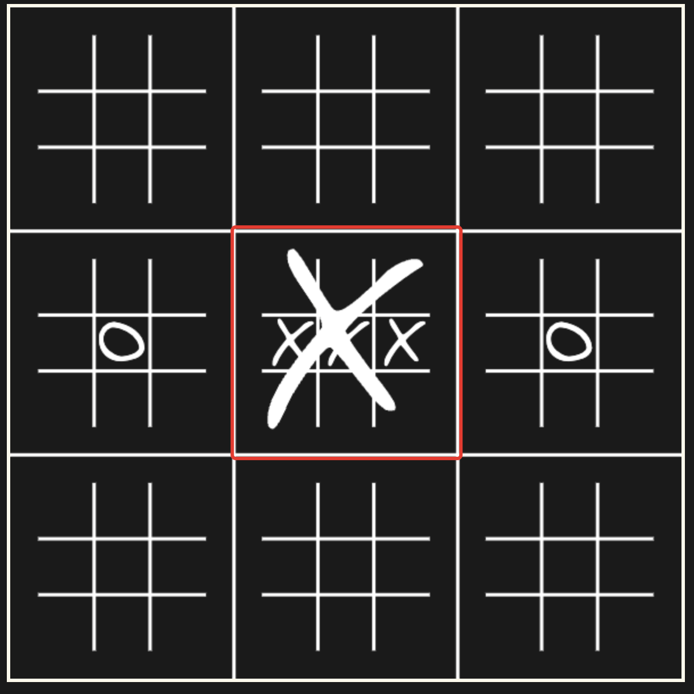

São jogos de tabuleiro implementados utilizando JS, com React para o front-end e a biblioteca boardgames.io para o back-end.

# Super Jogo da Velha

O Super Jogo da Velha é um jogo derivado do clássico jogo da velha, onde é preciso vender subjogos, para marcar no tabuleiro maior. Quem completar um sequência no tabuleiro maior, ganha.

| Month    | Savings |
| -------- | ------- |
|  | - | 

# Nhac Nhac (ou Gobblets Gobblers)

Nhac Nhac é um jogo de tabuleiro inspirado no jogo da velha clássico, onde invés de marcaçõs "X" e "O", são usados peças de personagens que podem sobrepor uns aos outros. Nessa versão, além de posicionar peças do estoque, peças do tabuleiro que estiverem por cima podem ser reposicionadas.
